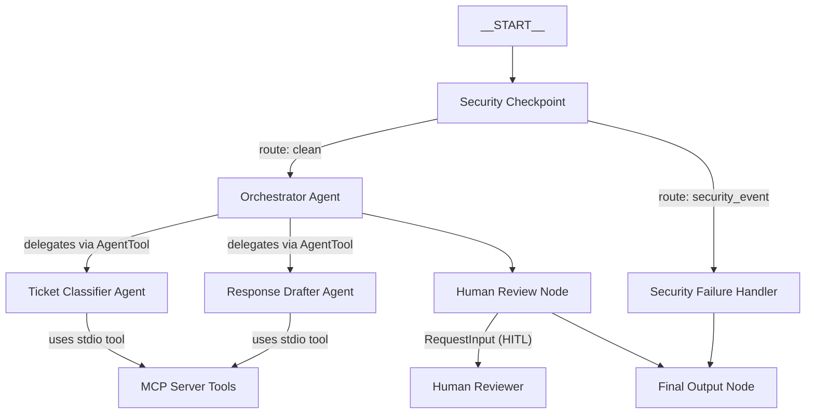

# ADK Agent Builder Submission — Support Ticket Router

## Problem Statement
In modern customer support environments, agents are overwhelmed by a high volume of incoming tickets. Quickly classifying issues, verifying customer SLAs, checking past context, and drafting responses is time-consuming. Furthermore, exposing raw tickets to Large Language Models (LLMs) poses security risks, such as leaking PII (Personal Identifiable Information) or exposing the system to prompt injection attacks.

This project addresses these issues by creating a secure, automated multi-agent support ticket classifier and response drafter.

---

## Solution Architecture

---

## Concepts Used

- **ADK Workflow Graph API**: Implemented in [agent.py](file:///c:/Users/acer/OneDrive/Desktop/Documents/capt-project/support-ticket-router/app/agent.py#L210) using `wf.Workflow` to orchestrate deterministic routing and LLM execution.
- **LlmAgent (Agent)**: Implemented in [agent.py](file:///c:/Users/acer/OneDrive/Desktop/Documents/capt-project/support-ticket-router/app/agent.py#L33-L75) to instantiate `ticket_classifier`, `response_drafter`, and the `orchestrator`.
- **AgentTool**: Used in [agent.py](file:///c:/Users/acer/OneDrive/Desktop/Documents/capt-project/support-ticket-router/app/agent.py#L77-L84) to register sub-agents as tools within the `orchestrator`, enabling hierarchical delegation.
- **MCP Server**: Defined in [mcp_server.py](file:///c:/Users/acer/OneDrive/Desktop/Documents/capt-project/support-ticket-router/app/mcp_server.py) and registered as an `McpToolset` in `agent.py` to expose live tools to agents.
- **Security Checkpoint**: The `security_checkpoint` node in [agent.py](file:///c:/Users/acer/OneDrive/Desktop/Documents/capt-project/support-ticket-router/app/agent.py#L86-L144) handles regex scrubbing and injection validation before any LLM is called.
- **Agents CLI**: Scaffolded using `agents-cli` to set up directory structures, dev dependencies, and config files.

---

## Security Design

1. **PII Scrubbing**:
   - Regex patterns scan for email addresses and phone numbers.
   - Replaces PII with tags `[EMAIL_REDACTED]` and `[PHONE_REDACTED]`.
   - Prevents leakage of sensitive customer details to the LLM backend.
2. **Prompt Injection Detection**:
   - Matches keywords ("ignore previous", "jailbreak", "system override").
   - Immediately routes traffic to `security_failure_handler` and blocks agent invocation.
3. **Structured Audit Log**:
   - Records every security decision, scrubbing event, and human action in `ctx.state["audit_log"]`.
   - Outputs the audit log as JSON to standard output.

---

## MCP Server Design

Our stdio-based MCP server in `app/mcp_server.py` implements 3 support-specific tools:
1. `lookup_kb_article`: Returns troubleshooting steps based on the classified category (Billing, Technical, Account). Used by `response_drafter`.
2. `get_ticket_history`: Retrieves summary of past tickets for the customer ID. Used by `response_drafter`.
3. `check_escalation_status`: Resolves support SLA details (response times and direct paths) based on the customer tier (gold, enterprise, standard). Used by `ticket_classifier`.

---

## HITL (Human-In-The-Loop) Flow

The workflow includes a mandatory human verification step in the `human_review` node.
- **Why**: LLM drafted responses may have minor inaccuracies or tone inconsistencies.
- **Flow**: The node yields `RequestInput` which pauses the workflow and exposes the draft to the human reviewer.
- **Actions**: The reviewer can reply `yes` to approve or provide feedback text to document rejection/manual routing.

---

## Demo Walkthrough

Refer to the 3 sample test cases in [README.md](file:///c:/Users/acer/OneDrive/Desktop/Documents/capt-project/support-ticket-router/README.md#sample-test-cases) for complete setup and test payloads for:
1. Clean Flow (Standard technical support routing)
2. PII Redaction (Privacy protection)
3. Prompt Injection Block (Security defense)

---

## Impact / Value Statement

- **For Support Agents**: Reduces manual lookup time by auto-classifying issues and drafting high-quality, SLA-compliant replies.
- **For Businesses**: Protects brand reputation by blocking prompt injections and preventing customer data leaks.
- **For Customers**: Speeds up response times while keeping their personal data completely secure.
